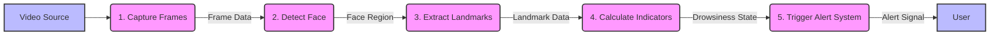

```mermaid
graph LR
    User -- Video Input --> System(Drowsiness Detection System);
    System -- Alerts --> User;
```

```mermaid
graph LR
    A[Video Source] --> P1(1. Capture Frames);
    P1 -- Frame Data --> P2(2. Detect Face);
    P2 -- Face Region --> P3(3. Extract Landmarks);
    P3 -- Landmark Data --> P4(4. Calculate Indicators);
    P4 -- Drowsiness State --> P5(5. Trigger Alert System);
    P5 -- Alert Signal --> Z[User];

    %% Style the processes
    style P1 fill:#f9f,stroke:#333,stroke-width:2px
    style P2 fill:#f9f,stroke:#333,stroke-width:2px
    style P3 fill:#f9f,stroke:#333,stroke-width:2px
    style P4 fill:#f9f,stroke:#333,stroke-width:2px
    style P5 fill:#f9f,stroke:#333,stroke-width:2px

    %% Style the external entities
    style A fill:#bbf,stroke:#333,stroke-width:2px
    style Z fill:#bbf,stroke:#333,stroke-width:2px
``` 
